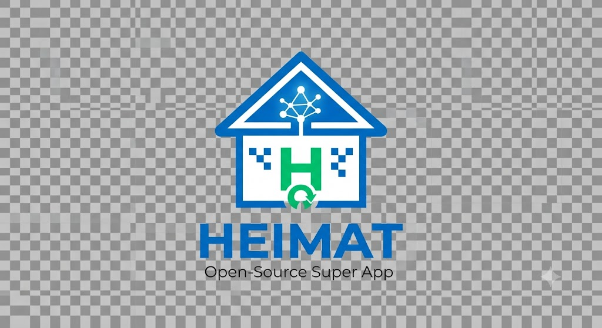

# HEIMAT 2.0

<p align="center">
  
</p>

<h3 align="center">Die erste Open-Source Super App für Deutschland</h3>

<p align="center">
  <a href="https://www.gnu.org/licenses/agpl-3.0">
    
  </a>
  <a href="https://github.com/abatn/HEIMAT">
    
  </a>
  <a href="https://opencollective.com/heimat">
    
  </a>
</p>

---

## Was ist HEIMAT 2.0?

HEIMAT 2.0 ist eine datenschutzkonforme, kostenfreie Super App für den deutschen Alltag. Die Plattform basiert ausschließlich auf Open-Source-Technologien und öffentlich zugänglichen Daten – ohne Verträge mit Banken, ohne staatliche Genehmigungen, ohne kommerzielle Partner.

### Kernprinzipien

- **100% Open Source** – Jeder Code ist öffentlich einsehbar und veränderbar
- **100% Kostenfrei** – Keine Lizenzgebühren, keine Abos, keine versteckten Kosten
- **100% Legal** – Nutzung nur von Diensten, die rechtlich unbedenklich sind
- **100% Datenschutzkonform** – DSGVO als Feature, nicht als Hindernis
- **100% Community-getrieben** – Entwicklung durch Freiwillige, nicht durch Unternehmen

---

## Features

### Mobilität
- Interaktive Karte mit OpenStreetMap
- ÖPNV-Verbindungssuche (GTFS)
- Routing für Fuß, Rad und Auto (OpenRouteService)
- Städtische Informationen (Wikipedia/Wikidata)

### Finanzen
- P2P-Zahlungen über GNU Taler
- Keine BaFin-Lizenz nötig
- Privacy-by-Design

### Gesundheit
- Arzt-Suche nach Fachrichtung und Ort
- Terminbuchung mit verfügbarer Zeitplanung
- Keine TI-Anbindung, keine Patientendaten

---

## Projektstruktur

```
HEIMAT/
├── src/
│   ├── mobile/          # Flutter App
│   │   ├── lib/
│   │   │   ├── features/
│   │   │   │   ├── mobility/    # ÖPNV, Karten, Routing
│   │   │   │   ├── finance/     # Taler P2P-Zahlungen
│   │   │   │   └── health/      # Arzt-Termine
│   │   │   └── core/            # Config, Theme, Navigation
│   │   └── pubspec.yaml
│   └── backend/         # Node.js Backend
│       ├── src/
│       │   ├── routes/          # API-Endpunkte
│       │   ├── services/        # Business-Logik
│       │   └── middleware/       # Error-Handler, etc.
│       └── package.json
├── AI-*.md              # AI-Strategie Dokumentation
├── blog/                # Blog-Beiträge
├── funding/             # Förderanträge
├── marketing/           # Marketing-Materialien
└── docs/                # Zusätzliche Dokumentation
```

---

## Technologie

| Komponente | Technologie |
|------------|-------------|
| Frontend | Flutter |
| Backend | Node.js + Express |
| Datenbank | PostgreSQL |
| Cloud | Hetzner Cloud |
| Karten | OpenStreetMap + MapLibre GL |
| Routing | OpenRouteService |
| Zahlungen | GNU Taler |
| Kommunikation | Matrix |
| CI/CD | GitHub Actions |

---

## Mitwirken

Siehe [CONTRIBUTING.md](CONTRIBUTING.md).

### Tests (via CI)

Tests laufen automatisch in GitHub Actions bei jedem Push/PR. Manuelle Ausführung:

```bash
# Backend Tests
cd src/backend
npm test

# Flutter Tests
cd src/mobile
src/mobile/flutter/bin/flutter test
```

---

## Contributing

Wir freuen uns über jeden Beitrag! Bitte lies zuerst die [CONTRIBUTING.md](CONTRIBUTING.md).

### Good First Issues

Schau dir unsere [Good First Issues](https://github.com/abatn/HEIMAT/labels/good-first-issue) an, wenn du einsteigen möchtest.

---

## Community

- **Matrix:** [HEIMAT Room](https://matrix.to/#/heimat:matrix.org)
- **Mastodon:** [@heimat@mastodon.social](https://mastodon.social/@heimat)
- **GitHub Discussions:** [Discussions](https://github.com/abatn/HEIMAT/discussions)

---

## Unterstützen

HEIMAT 2.0 ist ein gemeinnütziges Open-Source-Projekt. Wir sind auf Spenden angewiesen:

- **Open Collective:** [opencollective.com/heimat](https://opencollective.com/heimat)
- **GitHub Sponsors:** [github.com/sponsors/abatn](https://github.com/sponsors/abatn)

---

## Roadmap

| Phase | Status | Details |
|-------|--------|---------|
| Mobilität (OSM/Overpass/OSRM) | ✅ Abgeschlossen | Echte Haltestellen, Nominatim-Geocoding, Routing |
| Gesundheit (OSM + Registrierung) | ✅ Abgeschlossen | Echte Ärzte aus Overpass, Arzt-Registrierung |
| **User-Auth (JWT)** | ✅ Live (2026-07-25) | Register/Login/Logout end-to-end auf Render, Token in Browser-LocalStorage persistiert, AppBar mit ⋮-Logout |
| **Finanzen (JWT-Roundtrip)** | ✅ Live (2026-07-25) | Bearer-Token in allen 5 Mobile-HTTP-Calls; Backend `GET /wallet` neu; Schema-Migration |
| **Phase 23 Security-Härtung** | ✅ Live (2026-07-25) | `POST /api/migrate` entfernt; `preDeployCommand` Auto-Migration; `security.test.ts` Regression-Lock |
| Finanzen (Taler Wallet-Client) | ✅ Client-Code live, EUR-ready | Exchange-Client gegen `exchange.demo.taler.net` (Ed25519, KUDOS); EUR-ready via `TALER_EXCHANGE_URL` |
| UX-Modernisierung (Finance/Health/Mobility) | ✅ Abgeschlossen | Gradient-Karten, Pill-Nav, Bottom Sheets |
| **Phase A: Mini-Program-Container** | ✅ **Live (2026-07-27)** | **WebView-Framework mit 10 Mini-Programmen (Futai, Wetter, Luft, Events, Jobs, E-Ladestationen, Abfall, Hotels, Parken, Bürgeramt) + Apps-Tab + Conditional Imports** |
| **AI-Home Dashboard** | ✅ **Live** | **Personalisierter Startseiten-Tab mit Tageszeit-basierten Vorschlägen + Greeting-Card + Nearby-Stops** |
| CI-Fix-Runde 2 | ✅ **Grün** | `withOpacity` (Flutter 3.24.5), `unnecessary_non_null_assertion` entfernt, Conditional Imports korrigiert |

## 🚀 HEIMAT Expansion — Neue Services

HEIMAT expandiert von 3 auf **10+ Services** — inspiriert von WeChat/Grab, aber Open Source, Privacy-first, mit staatlichen Daten.

| Service | Datenquelle | Status | AI |
|---------|------------|--------|-----|
| 💬 Chat (Futai) | github.com/abatn/futai | ✅ Mini-Program-Container fertig (Commit 92ec307) | Ollama KI-Twin |
| 🌤️ Wetter | DWD (Deutscher Wetterdienst) | ⏳ Phase B | Unwetter-Früherkennung |
| 🌬️ Luftqualität | Umweltbundesamt (UBA) | ⏳ Phase B | Gesundheitsempfehlung |
| 🗑️ Abfallkalender | Kommunale Open Data | ⏳ Phase B | Sortier-Tipps |
| 🔌 E-Ladestationen | OpenStreetMap | ⏳ Phase C | Routenplanung |
| 💼 Job-Suche | BA Bundesagentur | ⏳ Phase D | Job-Matching |
| 📰 Veranstaltungen | Wikidata + OSM | ⏳ Phase D | Empfehlung |
| 🏨 Hotels | OpenStreetMap | ⏳ Phase E | Reise-Budget |
| 🏛️ Bürgeramt | Kommunale APIs | ⏳ Phase E | AI-Terminfindung |
| 🅿️ Parken | OpenStreetMap | ⏳ Phase C | — |

**Details:** knowledge.md, AGENTS.md, .claude/CLAUDE.md | **Code:** github.com/abatn/futai

---

## Phase 23 Recap — Stand Juli 2026

**Produktion läuft** — User-Auth, Finance-Roundtrip, Auto-Migration und Security-Härtung end-to-end live.

### ✅ Was funktioniert
- User-Auth (JWT+bcryptjs) — Register/Login/Logout end-to-end live auf `heimat-backend.onrender.com`
- Finance-JWT-Roundtrip — Bearer-Token in allen 5 Mobile-Finance-Calls; `GET /wallet` Backend-Route neu
- Security-Härtung — `POST /api/migrate` entfernt; `security.test.ts` Regression-Lock aktiv
- Auto-Migration — `AUTO_MIGRATE=true` startup-hook (7e5f063) — ✅ Live bestätigt am 2026-07-25 (Build-Log + funktionaler Beweis)
- Admin-Pfad — `ADMIN_KEY` auf Render; `/api/admin/migrate` positive-control HTTP 200 verifiziert
- DB — Supavisor-Pooler + IPv4-Force + SSL lösen Supabase-IPv6 Problem auf Render Free Tier
- Taler — `exchange.demo.taler.net` erreichbar (GET /keys + /reserves/<pub>)

### ✅ Phase 24: Demo-KUDOS und P2P-Durchstich (2026-07-26)
**Demo-KUDOS fund-local ist live!** Finanzen-Tab: "Guthaben aufladen" Button zeigt jetzt zwei Optionen: (a) "25 Demo-KUDOS erhalten" — sofort 25 KUDOS direkt in die DB, kein Exchange noetig; (b) "Reserve-Adresse erstellen" — fuer echten Taler-Bank-Wire. P2P-Purse-System bereit (createPurse/depositToPurse/mergePurse). EUR-Exchange wartet auf oeffentliche GLS-Bank-Integration.

### ⚠️ Was noch offen ist
- Flutter Integration-Tests

**📱 Taler aus der App — So geht's:**
Finanzen-Tab oeffnen -> Wallet auto-erstellt -> 0.00 KUDOS -> [Guthaben aufladen] -> Zwei Optionen: (1) "25 Demo-KUDOS erhalten" -> Balance sofort 25.00 KUDOS -> Geld senden testen. (2) "Reserve-Adresse erstellen" -> reserve_pub wird erzeugt -> bank.demo.taler.net -> ueberweisen -> zurueck -> [Aktualisieren].

### ❌ Was fehlt
- **auth_gate_test.dart (Commit 6274675)** — neue Testdatei, 1 Test (AuthGate→LoginScreen bei unauth), CI-gruen. Schritt 1/5 des inkrementellen Wiederaufbaus.
- Flutter Integration-Tests fehlen noch für Login → Finance → Logout Flow
- Auth-Routing-Bug Regression-Test
- `npm run migrate:status` health-check tool

## Lizenz

Dieses Projekt steht unter der [GNU Affero General Public License v3.0](LICENSE).

---

## Danksagung

- [OpenStreetMap](https://www.openstreetmap.org/) – Karten
- [GNU Taler](https://taler.net/) – Zahlungen
- [Cal.com](https://cal.com/) – Terminbuchung
- [Matrix](https://matrix.org/) – Kommunikation
- [OpenRouteService](https://openrouteservice.org/) – Routing

---

*Gemeinsam gestalten wir die digitale Zukunft Deutschlands.*
