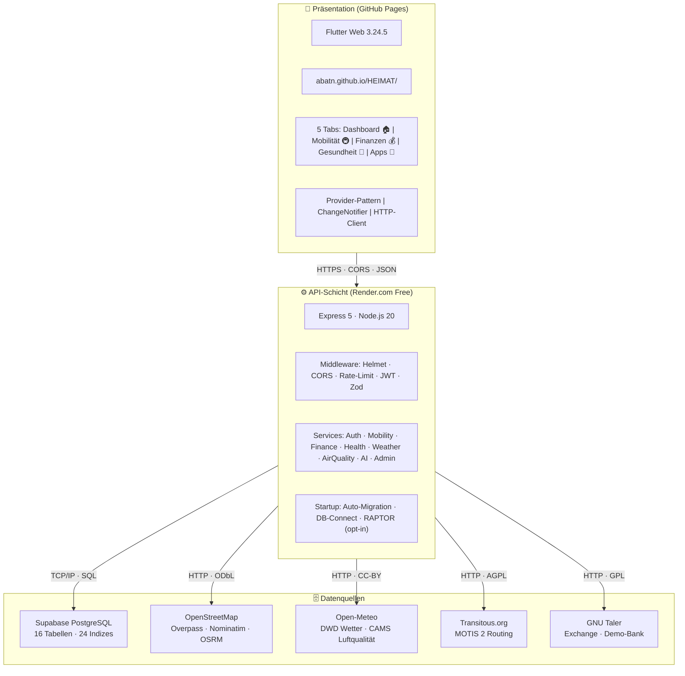
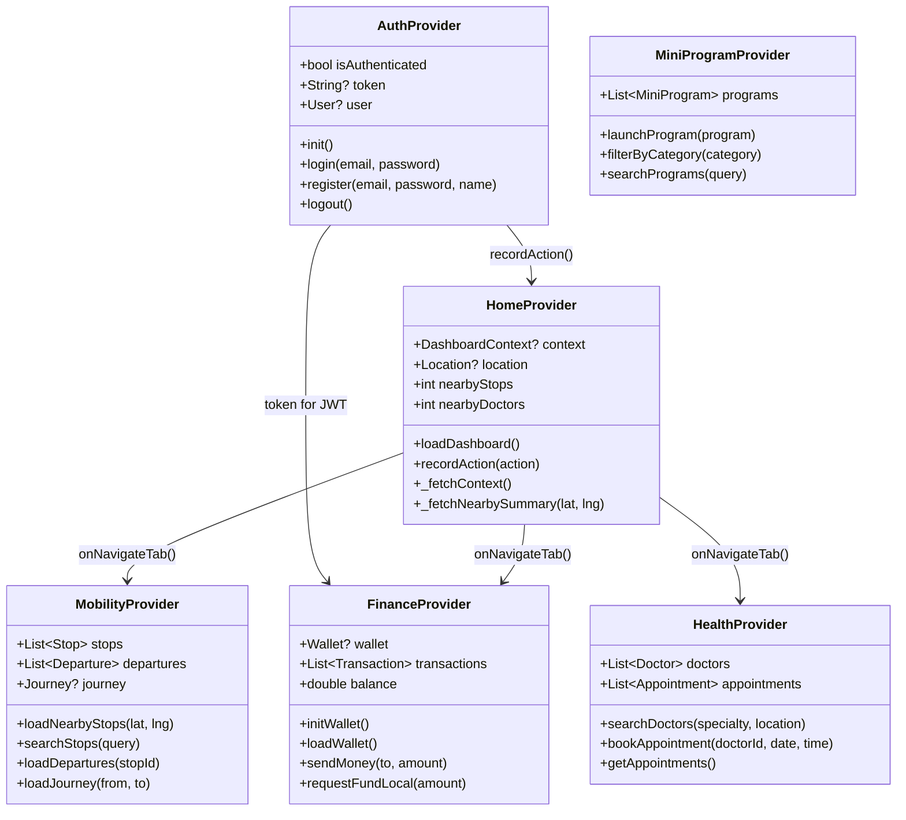
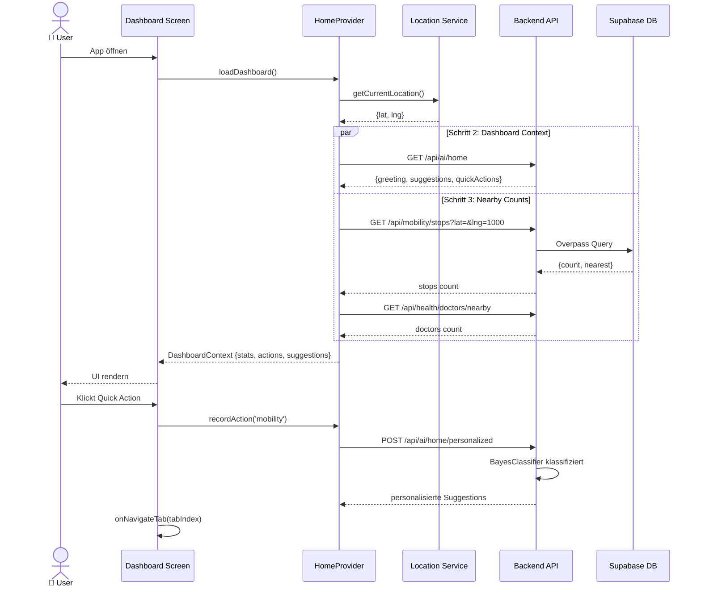
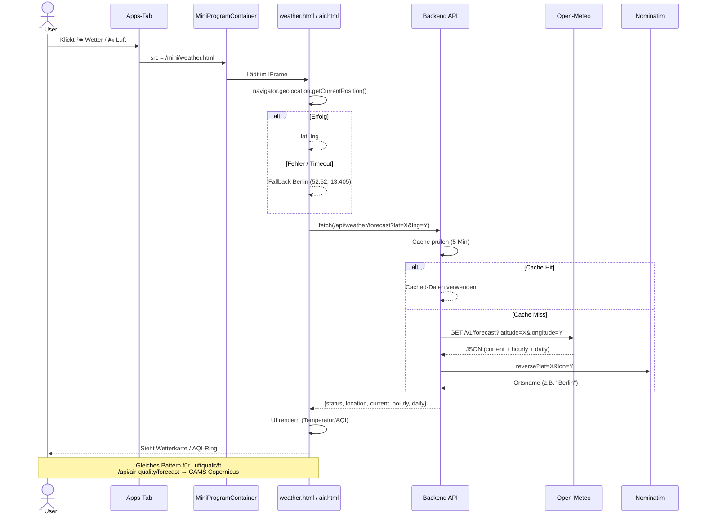
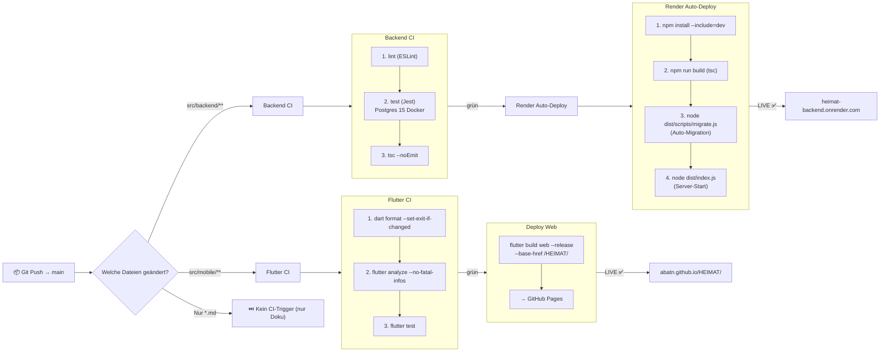
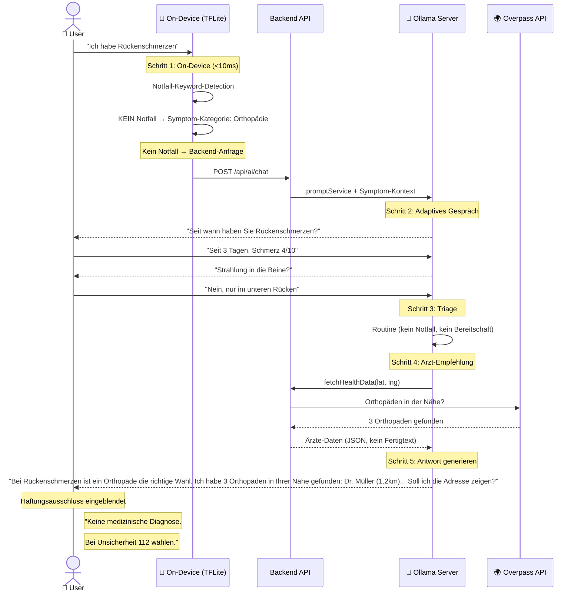
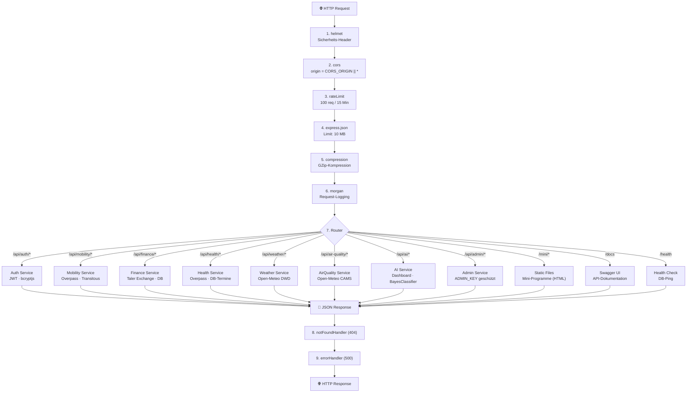
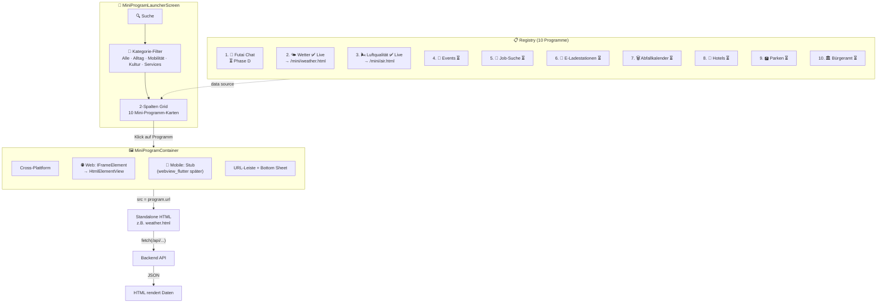
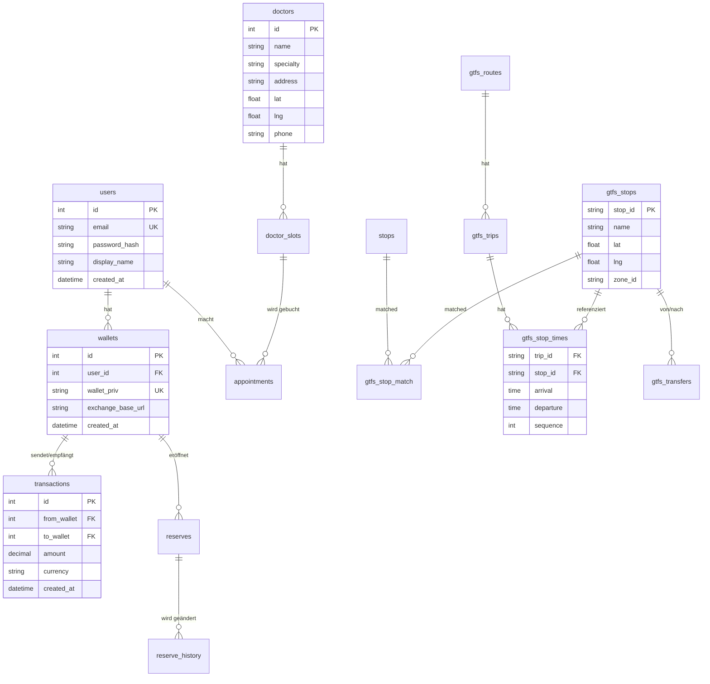
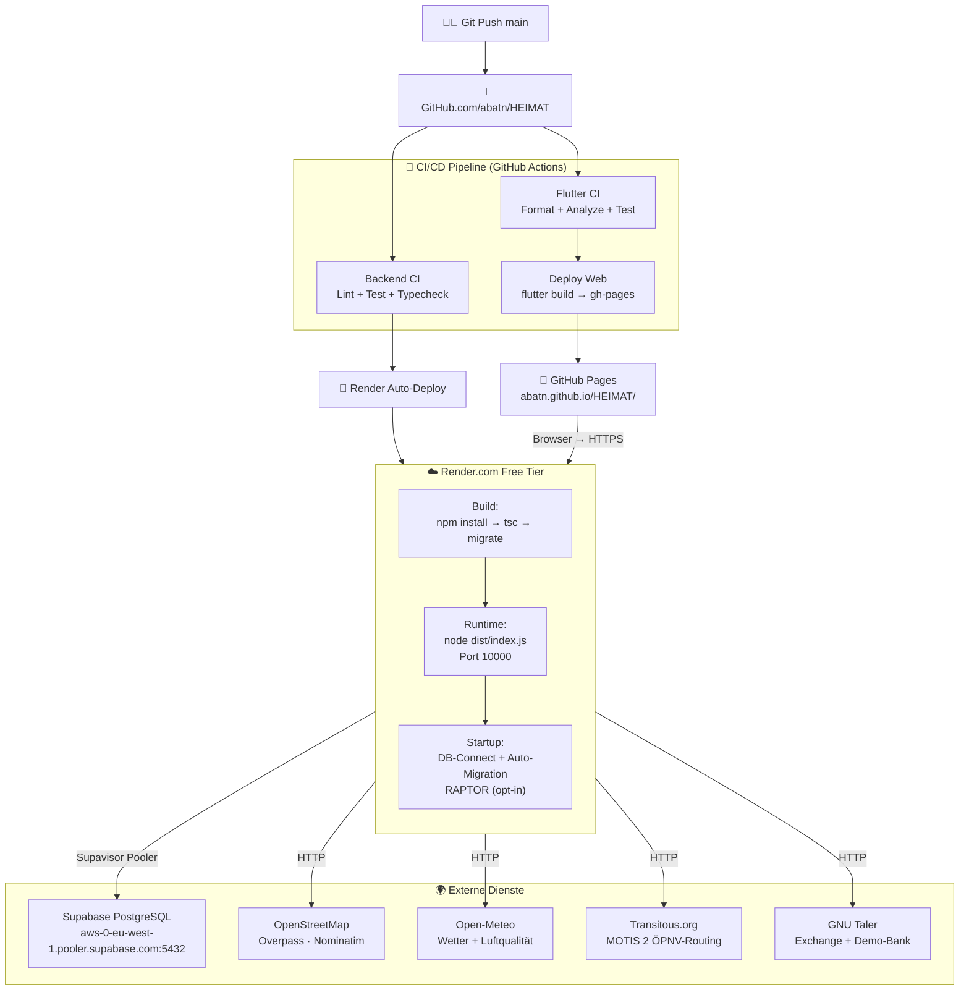

# HEIMAT 2.0 — Architektur-Diagramme

> **Stand:** 2026-07-27 | **Letzter Commit:** `5c69ea6`
> Diese Datei wird von GitHub nativ als Mermaid-Diagramm gerendert.
> [Mermaid Documentation](https://mermaid.js.org/)

---

## 1. Systemübersicht (C4 Level 1)

---

## 2. Provider-Struktur (Klassendiagramm)

---

## 3. Datenfluss: Dashboard (Sequenzdiagramm)

---

## 4. Datenfluss: Wetter + Luftqualität (Mini-Program)

---

## 5. CI/CD Pipeline

---

## 5b. Datenfluss: Health AI Agent (Symptom-Assessment + Triage)

---

## 6. Backend-Middleware-Stack

---

## 7. Mini-Programm-Launcher

---

## 8. Tabellen-Struktur (ER-Diagramm)

---

## 9. Deployment-Topologie

